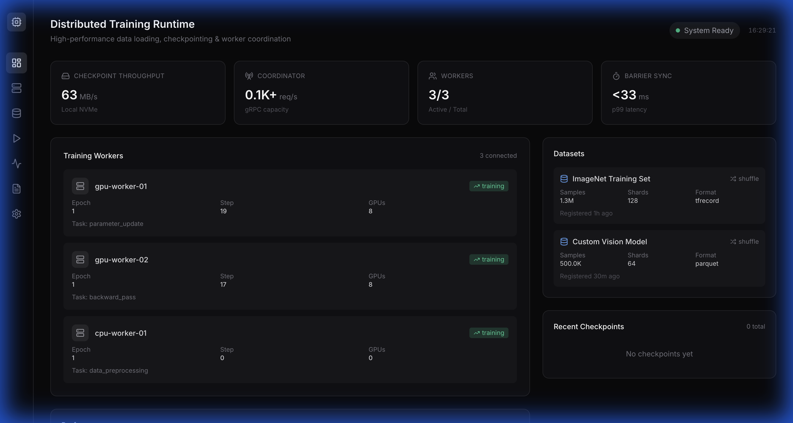
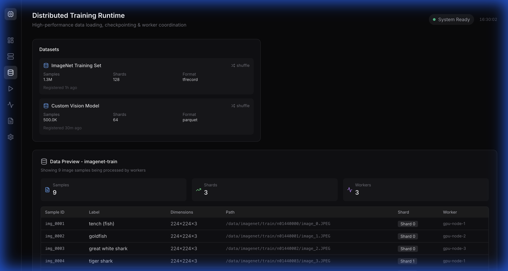
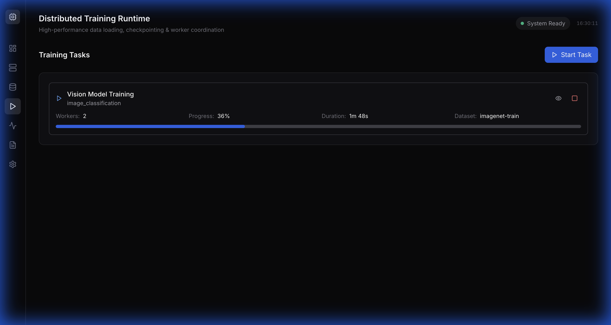
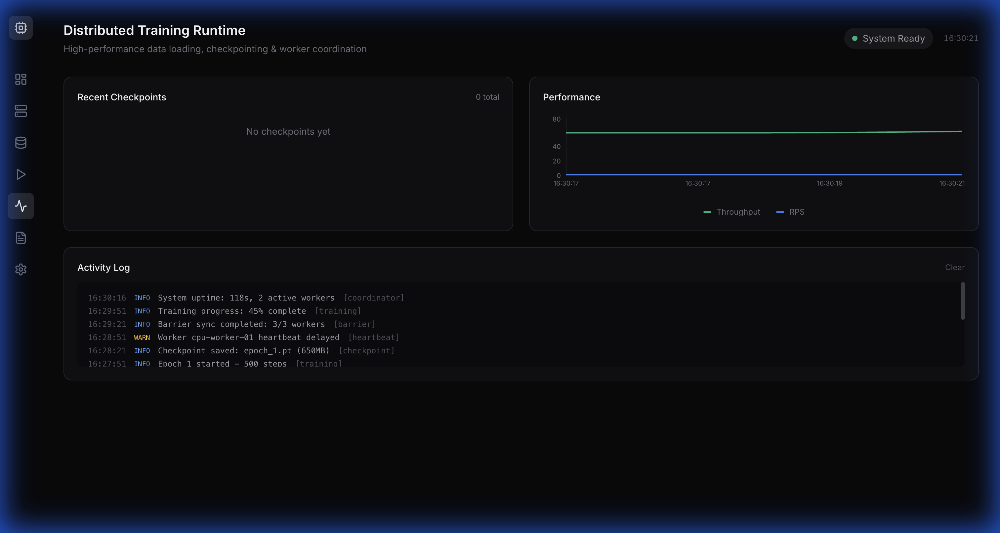
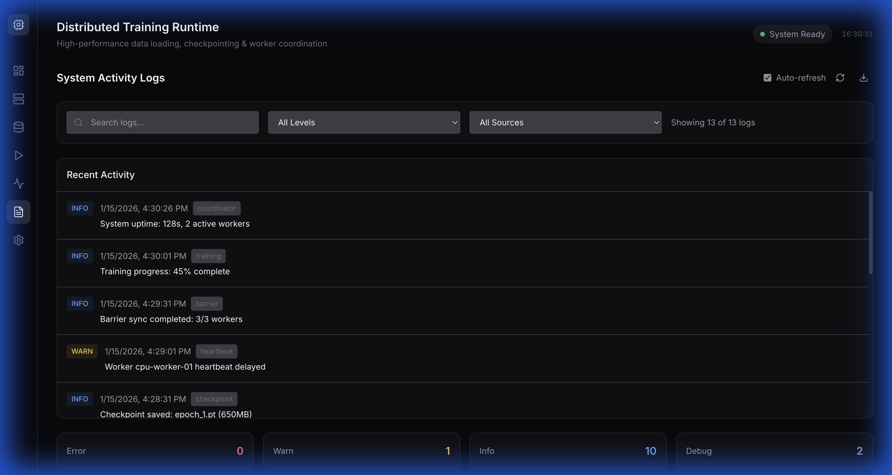
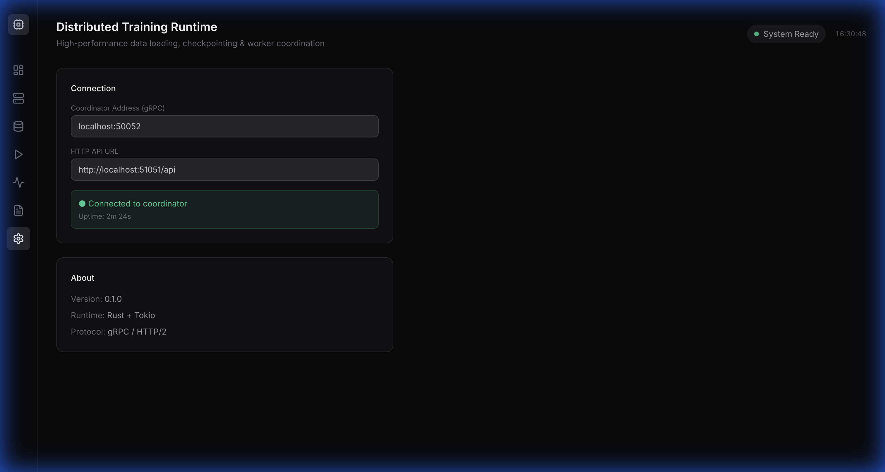

# Distributed Training Runtime Demo Walkthrough

This document demonstrates the functionality of the Distributed Training Runtime, highlighting the real-time dashboard and system coordination capabilities.

## Overview

The demo simulates a distributed training environment with:
- **Coordinator**: Rust-based gRPC service managing workers and state.
- **Workers**: Simulated GPU and CPU nodes performing training tasks.
- **Dashboard**: React-based UI for real-time monitoring.

## 1. Dashboard Overview

The main dashboard provides a "cockpit" view of the entire cluster.



**Key Metrics:**
- **Active Workers**: Shows connected workers (e.g., `gpu-worker-01`, `cpu-worker-01`) and their status.
- **Throughput**: Real-time checkpoint write speed (e.g., ~60 MB/s).
- **Latency**: Barrier synchronization latency (<30ms).
- **Training Progress**: Per-worker epoch and step counters.

## 2. Dataset Management

The runtime manages distributed datasets, handling sharding and assignment.



The **Datasets** page shows registered datasets (e.g., "ImageNet Training Set") and provides a live preview of the data being processed by the workers.

## 3. Active Tasks

Track ongoing training jobs and their progress.



Each bar represents a worker's progress through the current epoch, giving instant visual feedback on cluster utilization.

## 4. Activity & Performance

Monitor system performance over time.



This view charts key metrics like **Requests Per Second (RPS)** and **Throughput**, helping identify bottlenecks or performance regressions.

## 5. System Logs

Detailed event logs for debugging and auditing.



The logs capture coordinator events, worker registrations, barrier completions, and errors.

## 6. Settings

Connection details for the coordinator and API.



## How to Run the Demo

To run this demo yourself:

1.  **Start the services**:
    ```bash
    ./demo.sh
    ```

2.  **Or run manually**:
    ```bash
    # Terminal 1: Start Dashboard
    cd dashboard
    npm install
    npm run dev

    # Terminal 2: Start Coordinator (Demo Mode)
    DEMO_MODE=true cargo run --bin coordinator -- 0.0.0.0:50052
    ```

3.  **Open Browser**:
    Navigate to `http://localhost:3000`.
