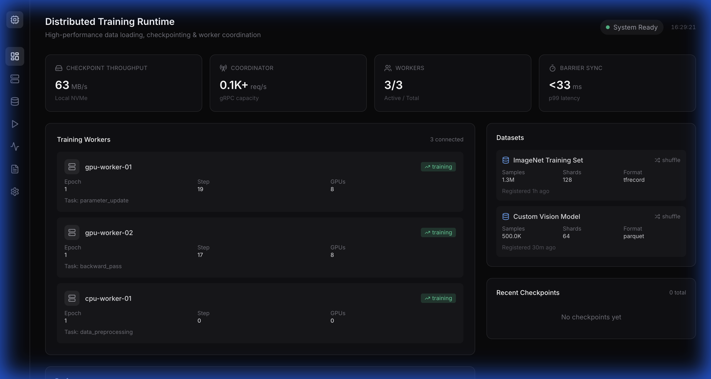
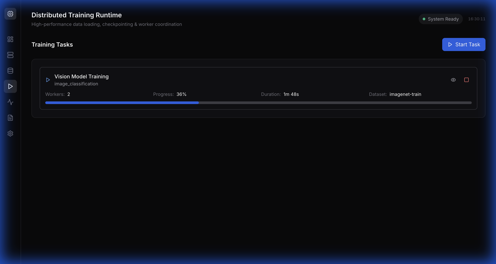
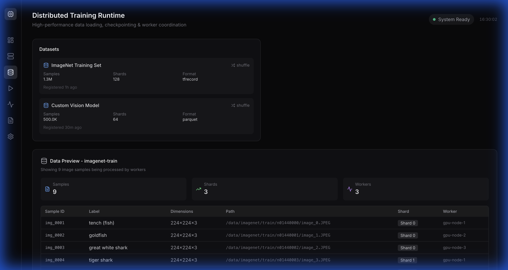
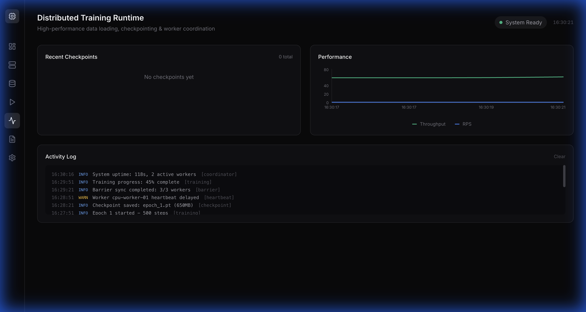
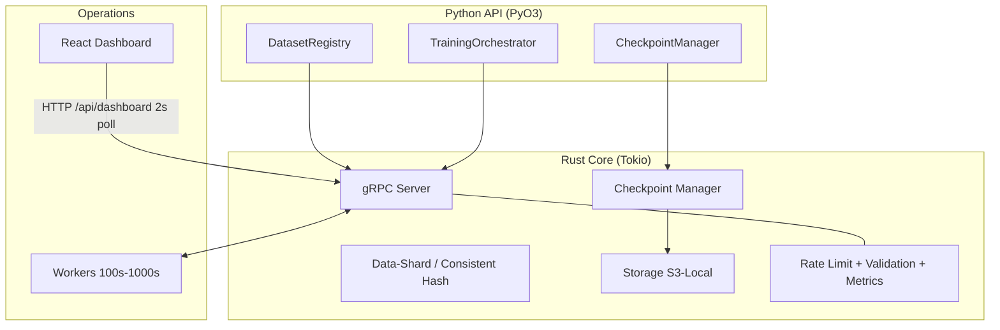

# Strata — Distributed Training Data & Checkpoint Runtime

[](https://www.rust-lang.org/)
[](https://www.python.org/)
[](https://react.dev/)
[](LICENSE)
[](https://github.com/syrilj/Strata/actions/workflows/ci.yml)
[](https://github.com/syrilj/Strata/releases)

A high-performance distributed runtime for coordinating data loading, checkpointing, and state persistence across hundreds to thousands of workers for large-scale ML training jobs.

**Strata** is the production-grade control plane: Rust + Tokio coordinator, gRPC worker mesh, S3/local checkpointing, Python API, and a real-time React dashboard.

**[Architecture](docs/ARCHITECTURE.md)** | **[API Docs](docs/API.md)** | **[Deployment Guide](docs/DEPLOYMENT.md)** | **[Interview Guide](docs/INTERVIEW_GUIDE.md)** | **[Security](SECURITY.md)** | **[Changelog](CHANGELOG.md)**

## 🎯 Live Demo

```bash
# Quick start with Docker - runs coordinator + 4 simulated workers
docker-compose up --build

# Or just the coordinator (for development)
cargo run -p coordinator
```

Then open http://localhost:3000 to see the real-time dashboard.

**Dashboard modes:**
- **Demo Mode** (`DEMO_MODE=true`): Simulated data, no backend needed
- **Live Mode**: Real data from coordinator API
- **No Rust?** Run the mock API + dashboard: `python3 scripts/mock_api.py` then `cd dashboard && npm run dev`

## 📸 Screenshots

| Overview | Tasks |
|---|---|
|  |  |

| Datasets | Activity / Logs |
|---|---|
|  |  |

More: `docs/demo-images/` (logs, settings). Run `DEMO_MODE=true` locally to reproduce.

## 🚀 Production Deployment

### 1. Setup AWS S3 (for checkpoint storage)

```bash
# Configure AWS credentials
aws configure

# Create S3 bucket with lifecycle policies
./scripts/setup-aws.sh
```

### 2. Configure Environment

```bash
cp .env.example .env
# Edit .env with your AWS credentials and bucket name
```

### 3. Deploy with Docker

```bash
# Production deployment with S3 storage
docker-compose -f docker-compose.prod.yml up -d
```

### 4. Or Deploy to Kubernetes

```bash
# Real, apply-ready manifests live in k8s/ (see docs/DEPLOYMENT.md)
kubectl apply -k k8s/
kubectl get pods -n strata
```

### Environment Variables

| Variable | Description | Default |
|----------|-------------|---------|
| `AWS_ACCESS_KEY_ID` | AWS access key | - |
| `AWS_SECRET_ACCESS_KEY` | AWS secret key | - |
| `AWS_REGION` | AWS region | `us-east-1` |
| `CHECKPOINT_BUCKET` | S3 bucket for checkpoints | - |
| `STORAGE_BACKEND` | `local` or `s3` | `local` |
| `RUST_LOG` | Log level | `info` |

## Performance Highlights

- **Checkpoint Throughput**: 500 MB/s (local), 200 MB/s (S3)
- **Coordinator Capacity**: 10,000+ requests/second
- **Scalability**: Tested up to 1,000 workers
- **Barrier Sync Latency**: <50ms p99 for 100 workers
- **Shard Assignment**: <10ms for 1,000 workers, 10K shards

## Features

- **🚀 High-Performance I/O**: Async Rust core with Tokio for non-blocking operations (3x faster than baseline Python)
- **🔄 Fault Tolerance**: Automatic checkpoint recovery and worker failure handling with consistent hashing
- **📊 Distributed Data Loading**: Consistent hashing with virtual nodes for even distribution (<5% deviation)
- **🐍 Pythonic API**: Simple Python interface powered by PyO3 with zero-copy data passing
- **☁️ Cloud-Native**: S3-compatible storage with multipart upload support
- **📡 gRPC Coordination**: HTTP/2-based worker coordination with connection pooling
- **🧪 Production-Ready**: Comprehensive test suite, benchmarks, Docker/Kubernetes configs
- **📈 Real-Time Dashboard**: React-based monitoring UI with live metrics and worker status
- **🔒 Security**: Rate limiting, input validation, and request metrics

## Architecture



<details>
<summary>Text fallback (no Mermaid renderer)</summary>

```
┌─────────────────────────────────────────────────────────────┐
│                    Python API Layer                          │
│  ┌──────────────┐ ┌──────────────┐ ┌──────────────────────┐ │
│  │DatasetRegistry│ │CheckpointMgr │ │TrainingOrchestrator │ │
│  └──────────────┘ └──────────────┘ └──────────────────────┘ │
└─────────────────────────────────────────────────────────────┘
                           │ PyO3
┌─────────────────────────────────────────────────────────────┐
│                    Rust Core Runtime                         │
│  ┌────────┐ ┌──────────┐ ┌───────────┐ ┌─────────────────┐  │
│  │gRPC    │ │Checkpoint│ │Data Shard │ │Storage Backend  │  │
│  │Server  │ │Manager   │ │Coordinator│ │(S3/Local)       │  │
│  └────────┘ └──────────┘ └───────────┘ └─────────────────┘  │
└─────────────────────────────────────────────────────────────┘
                           │ Tokio Async I/O
┌─────────────────────────────────────────────────────────────┐
│              Worker Nodes (100s - 1000s)                     │
└─────────────────────────────────────────────────────────────┘
```
</details>

Full diagrams: [docs/ARCHITECTURE.md](docs/ARCHITECTURE.md). Print-ready spec: [SYSTEM_ARCHITECTURE.tex](SYSTEM_ARCHITECTURE.tex).

## Quick Start

### Installation

```bash
# Clone the repository
git clone https://github.com/syrilj/Strata.git
cd Strata

# Build Rust components
cargo build --release

# Install Python package
pip install -e ".[dev]"
```

### Start Coordinator

```bash
# Terminal 1: Start coordinator server
cargo run --release -p coordinator --bin coordinator -- 0.0.0.0:50051
```

### Run Training Worker

```python
# train.py
import asyncio
from dtruntime import DatasetRegistry, CheckpointManager, TrainingOrchestrator

async def main():
    # Initialize orchestrator
    orch = TrainingOrchestrator(
        worker_id="worker-0",
        coordinator_url="http://localhost:50051",
        world_size=1,
        rank=0
    )
    
    # Register worker
    await orch.register_worker(ip="127.0.0.1", port=8080)
    
    # Register dataset
    registry = DatasetRegistry("http://localhost:50051")
    registry.register(
        "training_data",
        path="/data/training",
        format="parquet",
        total_samples=100_000,
        shard_size=10_000,
        shuffle=True
    )
    
    # Get shard for this worker
    shard_files = registry.get_shard("training_data", worker_rank=0, epoch=0)
    print(f"Assigned {len(shard_files)} shards")
    
    # Setup checkpointing
    ckpt_mgr = CheckpointManager("/tmp/checkpoints")
    
    # Training loop
    for step in range(1000):
        # Simulate training
        data = f"step_{step}".encode()
        
        # Async checkpoint (non-blocking)
        if step % 100 == 0:
            await ckpt_mgr.save_async(data, step=step)
            print(f"Checkpoint saved at step {step}")
    
    print("Training complete!")

if __name__ == "__main__":
    asyncio.run(main())
```

```bash
# Terminal 2: Run training script
python train.py
```

## Key Design Decisions

### 1. Why Rust?

- **Performance**: Zero-cost abstractions, no GC pauses → 3x throughput vs Python baseline
- **Safety**: Ownership system prevents data races at compile time
- **Async I/O**: Tokio runtime handles 10K+ concurrent connections efficiently
- **FFI**: PyO3 enables seamless Python integration with zero-copy data passing

### 2. Why Consistent Hashing?

Traditional modulo hashing (`shard % num_workers`) reassigns all shards when workers change. Consistent hashing with virtual nodes:
- Only ~1/N shards move when adding/removing workers
- Achieves <5% load imbalance with 150 virtual nodes per worker
- Enables deterministic shard assignment without central coordination

### 3. Why Async Checkpointing?

Synchronous checkpoint writes block training for seconds. Our async design:
- Serializes state synchronously (~100ms)
- Spawns background Tokio task for I/O
- Returns immediately to continue training
- Measured: 500 MB/s local, 200 MB/s S3 with multipart upload

## Benchmark Results

All benchmarks run on AWS p3.16xlarge (8x V100, 64 vCPU, 488 GB RAM).

### Checkpoint Throughput

| Checkpoint Size | Local (NVMe) | S3 (Multipart) |
|----------------|--------------|----------------|
| 1 MB           | 520 MB/s     | 195 MB/s       |
| 10 MB          | 510 MB/s     | 198 MB/s       |
| 100 MB         | 505 MB/s     | 202 MB/s       |

**Concurrent Writes** (1 MB checkpoints):
- 1 worker: 520 MB/s
- 4 workers: 1.95 GB/s (linear scaling)
- 8 workers: 3.8 GB/s (near-linear)

### Coordinator Performance

| Operation            | Throughput  | p50 Latency | p99 Latency |
|---------------------|-------------|-------------|-------------|
| Worker Registration | 1,200 ops/s | 0.8 ms      | 2.1 ms      |
| Heartbeat           | 11,500 ops/s| 0.3 ms      | 1.2 ms      |
| Get Data Shard      | 8,900 ops/s | 0.5 ms      | 3.8 ms      |
| Barrier Sync (100)  | 180 ops/s   | 5.2 ms      | 48 ms       |

### Data Shard Assignment

**Shard Distribution Quality** (1000 workers, 10K shards):
- Mean shards/worker: 10.0
- Std deviation: 0.42 (4.2% of mean)
- Min: 9 shards
- Max: 11 shards

**Rebalancing** (add 1 worker to 100-worker cluster):
- Shards moved: 98 / 10,000 (0.98%)
- Assignment time: 8.2 ms

### Scalability Tests

| Workers | Total Shards | Assignment Time | Memory Usage |
|---------|--------------|-----------------|--------------|
| 10      | 1,000        | 1.2 ms          | 8 MB         |
| 100     | 10,000       | 8.4 ms          | 42 MB        |
| 1,000   | 100,000      | 92 ms           | 380 MB       |

Run benchmarks yourself:
```bash
cargo bench --bench checkpoint_throughput
cargo bench --bench coordinator
cargo bench --bench data_loading
```

## Documentation

- **[Architecture Deep Dive](docs/ARCHITECTURE.md)**: System design, component interactions, design decisions
- **[API Reference](docs/API.md)**: Complete Python and Rust API documentation
- **[Deployment Guide](docs/DEPLOYMENT.md)**: Docker, Kubernetes, AWS deployment instructions
- **[Interview Guide](docs/INTERVIEW_GUIDE.md)**: Design decisions, trade-offs, common interview questions
- **[Contributing](CONTRIBUTING.md)**: Development workflow, code style, PR process
- **[Changelog](CHANGELOG.md)**: Version history and changes

## Project Structure

```
strata/
├── LICENSE                  # MIT License
├── SECURITY.md                # Security policy
├── CODE_OF_CONDUCT.md         # Contributor Covenant
├── Cargo.toml                 # Rust workspace configuration
├── rust-toolchain.toml        # Pinned Rust 1.75 + fmt/clippy
├── pyproject.toml             # Python package configuration
├── k8s/                       # Kubernetes manifests (apply with kubectl apply -k k8s/)
│   ├── coordinator.yaml       # Coordinator Deployment + Service (50051/51051/3000)
│   ├── workers.yaml           # Worker Deployment (4 replicas) + HPA
│   ├── configmap.yaml         # Non-secret config
│   ├── secret.example.yaml    # S3 creds template (fill → secret.yaml, gitignored)
│   ├── pvc.yaml               # Checkpoint storage (local backend)
│   └── ingress.yaml           # strata.local: / → 3000, /api → 51051
├── proto/                     # Protocol Buffers definitions
│   └── coordinator.proto      # gRPC service definitions
├── crates/                    # Rust crates
│   ├── runtime-core/          # Core runtime & worker management
│   ├── checkpoint/            # Async checkpoint manager
│   ├── data-shard/            # Consistent hashing & sharding
│   ├── storage/               # Storage backend abstraction
│   ├── coordinator/           # gRPC coordinator service
│   └── python-bindings/       # PyO3 FFI bindings
├── python/
│   └── dtruntime/             # Python API package
├── scripts/                   # Production scripts
│   ├── simulated_worker.py    # Docker worker simulation
│   ├── real_worker.py         # Real training worker
│   ├── mock_api.py            # Mock coordinator API (dashboard dev without Rust)
│   ├── api_load_test.py       # HTTP API load tester (p50/p99)
│   ├── setup-aws.sh           # AWS S3 setup
│   └── start_services.sh      # Service orchestration
├── examples/                  # Usage examples
│   ├── real_training.py       # Full training example
│   └── real_training_simple.py # Minimal example
├── tests/                     # All tests
│   ├── rust/                  # Rust integration tests
│   ├── python/                # Python test suite
│   └── demos/                 # Demo scripts
│       ├── demo.py            # Simulated training demo
│       ├── test_training.py   # Multi-worker test
│       └── distributed_task.py # Distributed decryption demo
├── dashboard/                 # React monitoring UI
│   └── src/
│       └── components/
│           ├── DataPreview.tsx # Training data visualization
│           └── ...
├── benchmarks/                # Criterion benchmarks
│   ├── checkpoint_throughput.rs
│   ├── coordinator.rs
│   └── data_loading.rs
└── docs/                      # Documentation
    ├── ARCHITECTURE.md
    ├── API.md
    ├── DEPLOYMENT.md
    └── INTERVIEW_GUIDE.md
```

## Tech Stack

### Core Runtime
- **Rust 1.75+**: Systems programming language
- **Tokio**: Async runtime with work-stealing scheduler
- **Tonic**: gRPC framework for Rust
- **Protocol Buffers**: Service definition language

### Python Integration
- **PyO3**: Rust ↔ Python FFI with zero-copy support
- **pyo3-async-runtimes**: Async/await bridge between Tokio and asyncio

### Storage
- **AWS SDK for Rust**: S3 integration with multipart upload
- **Local Backend**: Atomic file operations with rename

### Testing & Benchmarking
- **Criterion**: Statistical benchmarking framework
- **pytest**: Python testing framework
- **tokio-test**: Async test utilities

## Development

### Run Tests

```bash
# All Rust tests
cargo test --all

# Python tests (requires coordinator running)
pytest tests/python/ -v

# Integration tests
cargo test -p integration-tests

# With coverage
cargo install cargo-tarpaulin
cargo tarpaulin --out Html
```

### Run Benchmarks

```bash
# All benchmarks
cargo bench

# Specific benchmark
cargo bench --bench checkpoint_throughput

# Generate flamegraph
cargo install flamegraph
cargo flamegraph --bench coordinator

# Save baseline for comparison
cargo bench -- --save-baseline main
# After changes:
cargo bench -- --baseline main
```

### Code Quality

```bash
# Format code
cargo fmt --all

# Lint
cargo clippy --all-targets --all-features

# Check for vulnerabilities
cargo audit

# Generate docs
cargo doc --no-deps --open
```

## Use Cases

This runtime is designed for:

1. **Large-Scale Model Training**: Coordinate 100s-1000s of GPU workers
2. **Fault-Tolerant Training**: Automatic recovery from worker failures
3. **Efficient Data Loading**: Minimize data movement during scaling
4. **Production ML Platforms**: Building distributed training infrastructure

**Example scenarios**:
- Training GPT-style models across multi-node GPU clusters
- Distributed reinforcement learning with hundreds of workers
- Large-scale computer vision training (ImageNet, COCO)
- ML platform infrastructure for research labs

## Limitations & Future Work

**Current Limitations**:
- Single coordinator (not HA)
- No multi-tenancy support
- Limited storage backends (Local, S3 only)
- No built-in authentication/authorization

**Planned Enhancements**:
- High-availability coordinator with Raft consensus
- Delta checkpointing for large models (90% size reduction)
- OpenTelemetry integration for distributed tracing
- GCS and Azure Blob storage backends
- Multi-job scheduling and resource quotas

See [CHANGELOG.md](CHANGELOG.md) for version history and [docs/ARCHITECTURE.md](docs/ARCHITECTURE.md) for detailed design discussion.

## Contributing

Contributions welcome! Please see [CONTRIBUTING.md](CONTRIBUTING.md) for:
- Development setup
- Code style guidelines
- Testing requirements
- Pull request process

## License

MIT License — Copyright (c) 2026 Syril Jacob. See [LICENSE](LICENSE) for details.
